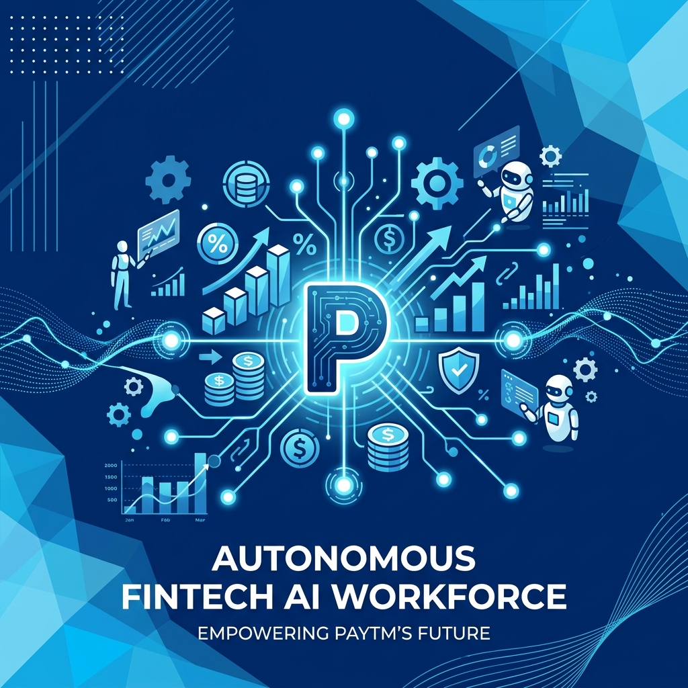
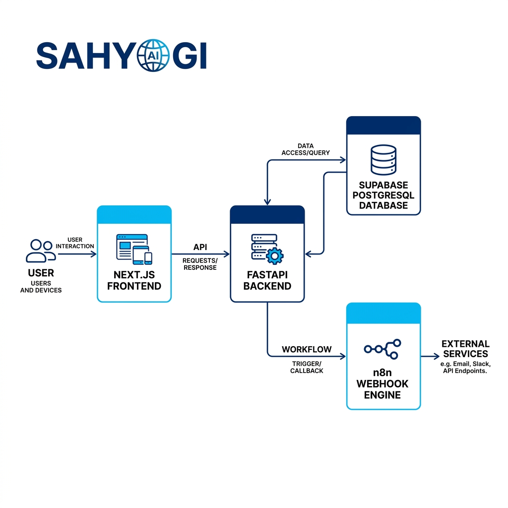
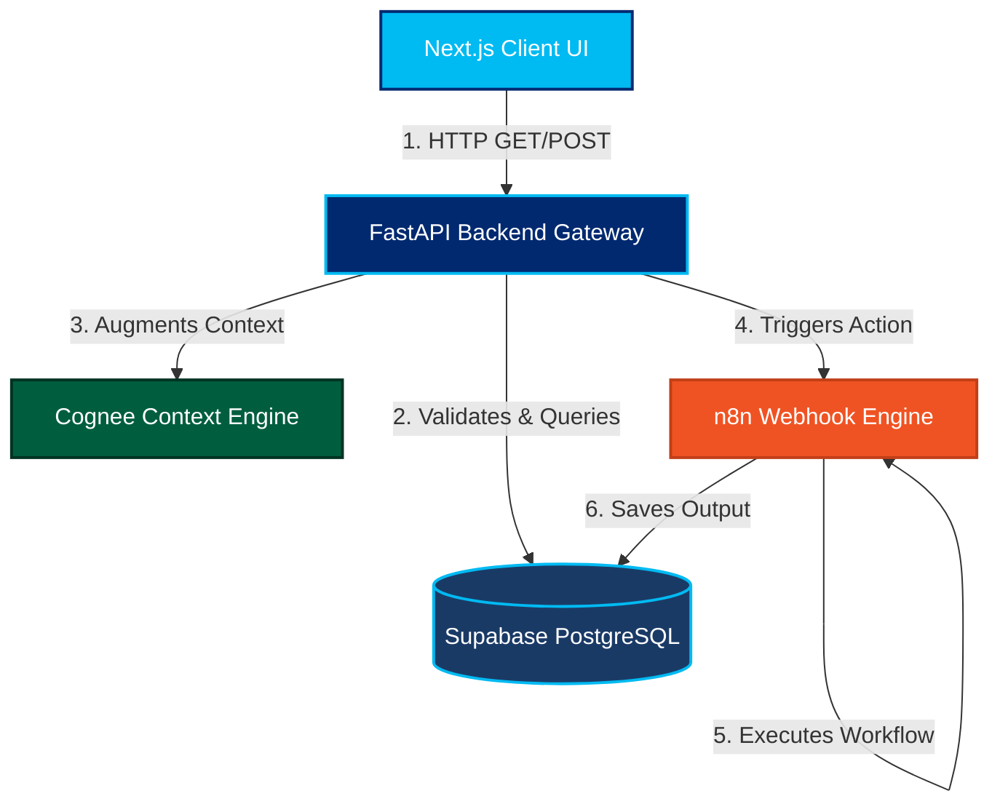

<div align="center">
  
  
  <h1>SAHYOGI</h1>
  <p><b>Paytm's Autonomous AI Workforce Platform</b></p>

  <p>
    <a href="#overview">Overview</a> •
    <a href="#features">Features</a> •
    <a href="#architecture">Architecture</a> •
    <a href="#agent-playground">Live Playground</a> •
    <a href="#getting-started">Getting Started</a>
  </p>
</div>

---

## 🚀 Overview

**Sahyogi** is a full-stack, enterprise-grade AI orchestration platform built specifically for **Paytm**. It allows you to deploy, manage, and monitor a highly contextual, autonomous AI workforce across various organizational verticals (Sales-AI, Support-AI, Risk-AI). 

Unlike traditional AI wrappers, Sahyogi treats AI agents as *first-class employees* with strict permissions, role-based access, individual memories, and verifiable audit trails. 

<div align="center">
  <blockquote>
    <i>"Work never loses its context. Capture what matters today, so your team can move confidently tomorrow."</i>
  </blockquote>
</div>

---

## ✨ Major Features

- **🛡️ KYA (Know Your Agent) Verified**: Every agent operates under a strict permission boundary with human-in-the-loop escalation for sensitive actions.
- **🧠 Shared Memory & Context**: Agents can dynamically share their context (Memory, Skills, Knowledge) with other agents via a powerful Postgres junction architecture.
- **⚡ Live Agent Playground**: An immersive, split-screen UI to watch your AI workforce in real-time. Watch the Sales agent draft emails based on CRM data, or the Support agent navigate complex refund logic in live-chat.
- **📊 Real-time ROI & Monitoring**: Track every autonomous task completed, human hours saved, and escalation percentages directly from the dashboard.
- **🔗 Secure Sub-Agent Workflows**: Designed securely with a FastAPI backbone acting as a gateway to execute robust n8n sub-agent workflows.

---

## 🏗️ Architecture Flow

Sahyogi is built with security and scale in mind. Our architecture strictly separates the **Front-End UI**, **API Gateway (FastAPI)**, and **Execution Engine (n8n)**.

### Architecture Diagram
<div align="center">
  
</div>

### System Workflow


---

## 🎮 The Agent Playground

The **Live Playground** is Sahyogi's flagship feature for verifying agent autonomy.
Clicking the `Live Playground ⚡` button on an Agent Card dynamically boots up an interactive dashboard specific to that agent's role.

### Examples:
1. **Sales-AI:** View the live CRM pipeline on the left while watching the agent's internal thought process and final outbound email draft materialize on the right.
2. **Support-AI:** View live support tickets (with Customer Tier highlights) while watching the agent dynamically chat with customers, query policies, and escalate refunds.

---

## 🛠️ Getting Started

### Prerequisites
- Node.js (v18+)
- Python 3.10+
- n8n (Local or Cloud)
- Supabase (Local or Cloud)

### Installation

**1. Clone the repo & setup Frontend**
```bash
git clone https://github.com/raj3000k/sahyogi-prototype.git
cd sahyogi-prototype
npm install
npm run dev
```

**2. Setup the FastAPI Backend**
```bash
cd backend
python -m venv venv
source venv/bin/activate
pip install -r requirements.txt
uvicorn main:app --reload --port 8000
```

**3. Configure Environment**
Duplicate `.env.example` in the backend folder to `.env` and fill in your Supabase credentials:
```env
SUPABASE_URL="your-supabase-url"
SUPABASE_KEY="your-supabase-key"
N8N_WEBHOOK_URL="your-n8n-webhook"
```

---

<div align="center">
  <p>Built with 💙 for the Paytm Innovation Lab.</p>
</div>
